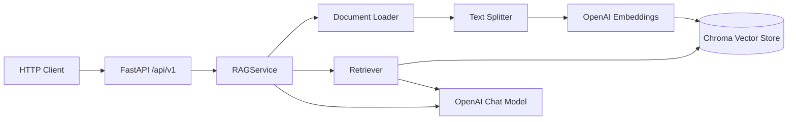

# Architecture

This document describes the system design for **basic-rag-python** — a small but production-minded RAG service.

## Goals

- **Separation of concerns**: HTTP layer, configuration, and RAG logic are isolated.
- **Local-first development**: Chroma persists vectors on disk; no external DB required for prototyping.
- **Swappable components**: Embeddings, vector store, and LLM are wired through LangChain abstractions.
- **Explicit API contracts**: Pydantic schemas define every request and response.

## High-level flow

### Ingestion path

1. Documents arrive via **directory ingest** (`data/documents/`) or **file upload**.
2. `document_loader` selects the correct LangChain loader by extension (`.txt`, `.md`, `.pdf`).
3. `RecursiveCharacterTextSplitter` chunks text with configurable size and overlap.
4. Chunks are embedded with OpenAI and stored in a persistent Chroma collection.

### Query path

1. The user question is embedded and used for **similarity search** in Chroma.
2. Top-k chunks are formatted into a prompt context.
3. An LCEL chain passes context + question to the chat model.
4. The API returns the generated answer plus the retrieved source chunks.

## Layer responsibilities

| Layer | Location | Responsibility |
|-------|----------|----------------|
| API | `app/api/v1/` | Routing, validation, HTTP errors |
| Schemas | `app/schemas/` | Request/response models |
| Core | `app/core/` | Settings, logging, DI |
| RAG | `app/rag/` | Document processing, vector store, chain |
| Data | `data/` | Raw documents and Chroma persistence |

## Key design choices

### LangChain LCEL for the RAG chain

The retrieval chain uses LangChain Expression Language (LCEL) instead of legacy `RetrievalQA` chains. This keeps the pipeline composable and aligns with LangChain 1.x patterns.

### Chroma for local vector storage

Chroma provides a zero-ops persistent store suitable for development and small deployments. For production scale, swap `vectorstore.py` to Pinecone, pgvector, or another backend without changing API routes.

### OpenAI for embeddings and generation

`text-embedding-3-small` balances cost and quality. `gpt-4o-mini` handles answer generation with low latency. Both are configurable via environment variables.

### FastAPI dependency injection

`RAGService` is provided through `get_rag_service()` so routes stay thin and the service can be mocked in tests.

### API versioning

Routes are mounted under `/api/v1` to allow future breaking changes without disrupting existing clients.

## Extension points

| Need | Where to extend |
|------|-----------------|
| New file types | `app/rag/document_loader.py` |
| Different vector DB | `app/rag/vectorstore.py` |
| Custom prompt | `app/rag/chain.py` |
| Auth / rate limits | FastAPI middleware or dependencies |
| Async ingestion | Background tasks or a job queue in `RAGService` |

## Security considerations

- **API keys** must be set via environment variables, never committed.
- **Upload size** is capped at 10 MB per file in the documents endpoint.
- **No authentication** is included by design; add API keys or OAuth before exposing publicly.

## Future improvements

- Hybrid search (keyword + semantic)
- Re-ranking retrieved chunks
- Conversation memory / multi-turn chat
- Observability (LangSmith, OpenTelemetry)
- Container image and CI pipeline
